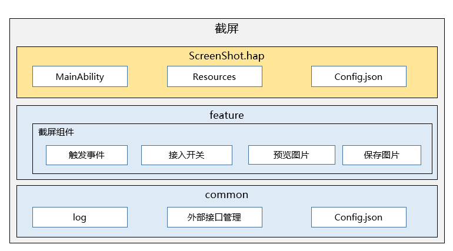

# ScreenShot

## 简介

ScreenShot应用是OpenHarmony中预置的系统应用，为用户提供截取当前屏幕，并保存当前图片的功能。

### 架构图



## 目录

```
/applications/standard/screenshot
    ├── entry                           # entry模块目录
    ├── common                          # 通用工具类目录
    ├── build.gradle                    # 全局编译配置文件
    ├── settings.gradle                 # 编译模块配置文件
    ├── LICENSE                         # 许可文件
    ├── signature                       # 证书文件目录
    ├── features                        # 子组件目录
    │   ├── screenshot                  # 截屏组件   
    │       ├── screenShotModel         # 截屏图片保存等   
    ├── product                         # ScreenShot总体功能目录
```

## 签名
1.针对product/phone下的每一个模块，配置build.gradle中的signingConfigs

2.将signature目录下的screenshot.p7b放在build.gradle目录中配置的相应路径即可


## 使用方法

通过create创建截屏小窗口用于显示图片，示例代码如下

```js
// 创建截屏小窗口用于显示图片
window.create(context, windowName, WINDOW_TYPE).then((win) => {
  win.moveTo(0, WINDOW_Y).then(() => {
    win.resetSize(dis.width * ZOOM_RATIO, dis.height * ZOOM_RATIO).then(() => {
      win.loadContent(INDEX_PAGE).then(() => {
      })
    })
  })
}, (error) => {
  Log.showInfo(TAG, " window createFailed, error.code = " + error.code)
})


// 截取当前屏幕，返回值可以直接显示控件上
Screenshot.save().then(async (data) => {
  if (!!data) {
    show();
  }
}).catch((err) => {
  Log.showInfo(TAG, `save err`);
})
    
```

## 相关仓

系统应用

**applications\_screenshot**